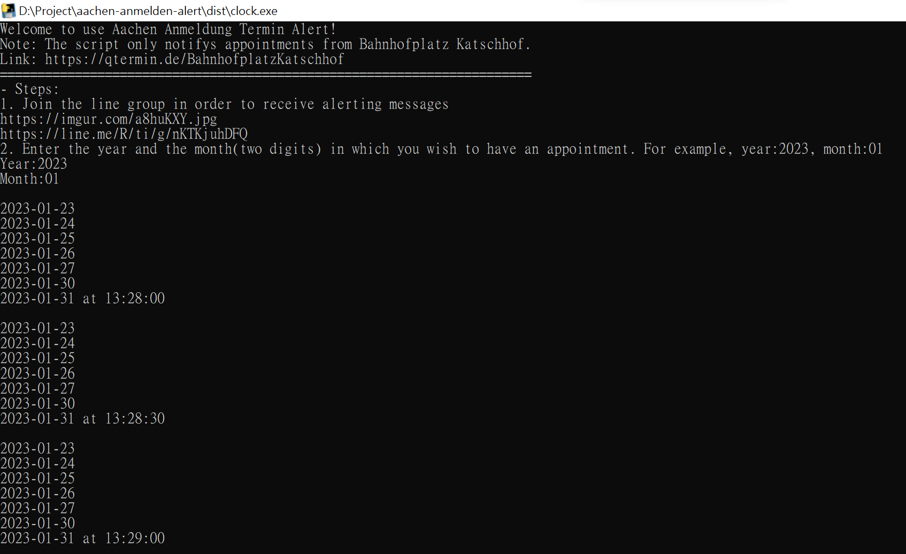

# Aachen-Termin-Alert

## Download
[Link](https://github.com/noworneverev/aachen-termin-alert/releases/download/1.0.0/clock.exe)

## Usage
1. Join the line group in order to receive alerting messages
    
2. Enter the year and the month(two digits) in which you wish to have an appointment. For example, year:2023, month:01

## Note
- The script only notifys anmeldung appointments from Bahnhofplatz Katschhof. 
[https://qtermin.de/BahnhofplatzKatschhof](https://qtermin.de/BahnhofplatzKatschhof)
- It's not a good practice to hardcode token, but in this case I think it's easier for one who is not familiar with Python to modify the token so to send to his/her own group. Just do not abuse the token, thank you.

## Screenshot
